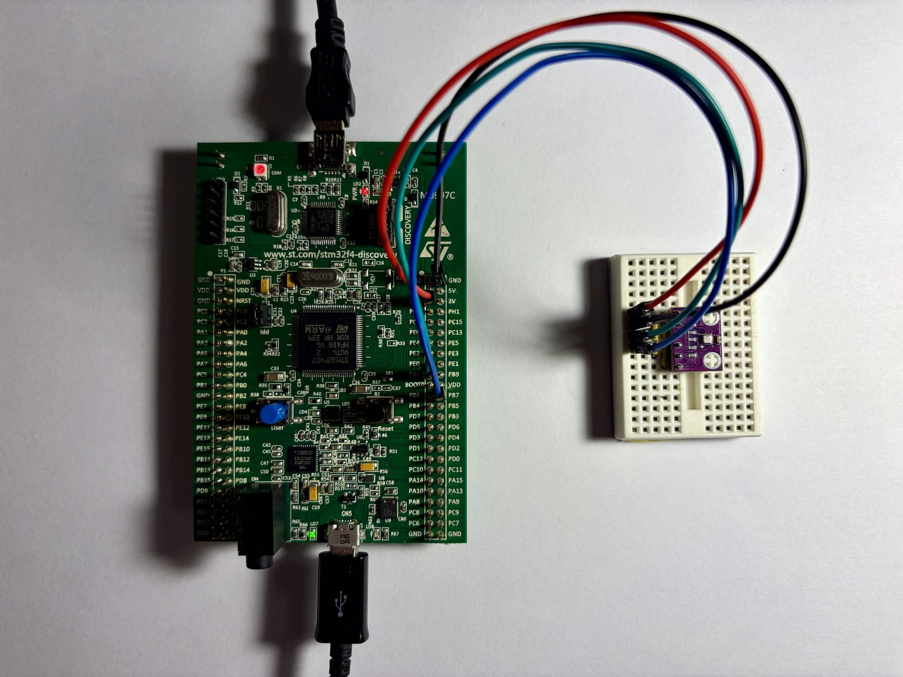
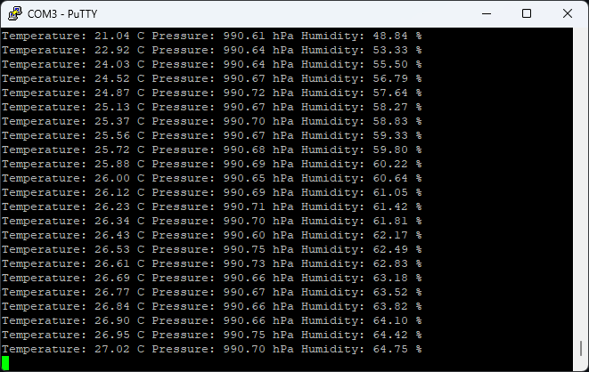
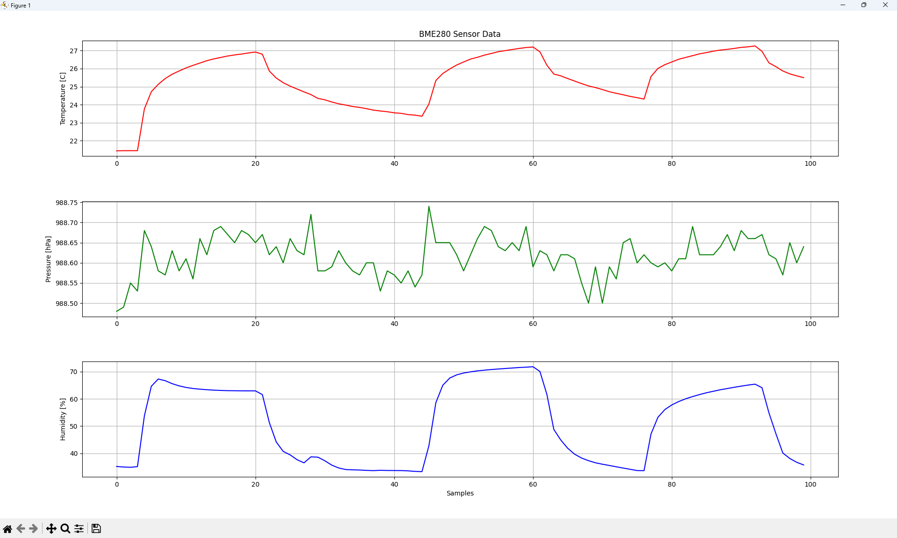

# STM32F4 Environmental Data Monitor (BME280)

## Project Description and Characteristics

This project focuses on reading environmental data (temperature, atmospheric pressure, and humidity) using an **STM32F4DISCOVERY** board (equipped with the STM32F407VGT6 microcontroller) and a **BME280** sensor. 

The collected data is formatted and transmitted to a PC terminal via a Virtual COM Port (VCP) at a frequency of 1 Hz. Additionally, a custom Python script is provided for real-time graphical visualization of the incoming serial data. The communication between the microcontroller and the sensor is established using the I2C_1 interface. 

**Key Characteristics:**
* **Readout Frequency:** 1 Hz
* **Data Output Format:** `Temperature: 21.09 C Pressure: 990.55 hPa Humidity: 44.86 %`
* **Sensor Communication:** I2C_1
* **PC Communication:** Virtual COM Port (e.g., COM3) monitored via PuTTY.
* **Data Visualization:** Real-time plotting using Python (`matplotlib` and `pyserial`).

## Hardware Configuration

### Circuit Setup
Below is the physical configuration of the connected hardware:

### Pinout Table
The BME280 sensor is connected to the STM32F4DISCOVERY board according to the following pinout. The `CSB` and `SDO` pins are configured specifically to select the I2C interface and set the appropriate I2C address (`0x76`).

| BME280 Pin | STM32 Pin | Description |
| :---: | :---: | :--- |
| **VCC** | 3V | Power |
| **GND** | GND | Ground |
| **SCL** | PB8 | I2C_1 Clock |
| **SDA** | PB7 | I2C_1 Data |
| **CSB** | 3V | Select I2C interface |
| **SDO** | GND | Set sensor's I2C address to `0x76` |

## Example Operation

### Terminal Output (PuTTY)
The data can be streamed directly to a terminal emulator (PuTTY) on the PC via the specified COM port.

The image below demonstrates a real-time test of the sensor's responsiveness. Upon placing a finger on the BME280 sensor, a clear rise in temperature can be observed (from 21.04 °C to 27.02 °C).

### Real-Time Visualization (Python)
By running the included Python script, the serial data is parsed and displayed on a live updating plot. The image below demonstrates a real-time test of the sensor's responsiveness. Upon placing a finger on the BME280 sensor, a clear, rapid rise in both temperature and humidity can be observed on the plots.

## Software Implementation

A core component of this project is the software developed to handle sensor communication, data processing, and visualization:

* **[`bme280.c`](bme280.c) / [`bme280.h`](bme280.h):** This library is responsible for reading the raw, uncompensated data directly from the sensor's registers via I2C. It then applies the necessary compensation formulas to calculate accurate, human-readable values for temperature, pressure, and humidity.
* **[`main.c`](main.c):** The main application utilizes data from the `bme280.c` library and writes the formatted data to the Virtual COM Port.
* **[`bme280_plot.py`](bme280_plot.py):** A Python script utilizing the `pyserial` and `matplotlib` libraries to connect to the COM port, read the incoming strings, parse the environmental values, and plot them in real-time.

## Hardware Used
* STM32F4DISCOVERY (STM32F407VGT6)
* Bosch BME280

## Software Used
* STM32CubeMX 6.17.0
* STM32CubeIDE 2.1.1

## Manufacturer Datasheet
* [BME280 Official Datasheet PDF](Documentation/bst-bme280-ds002.pdf)
